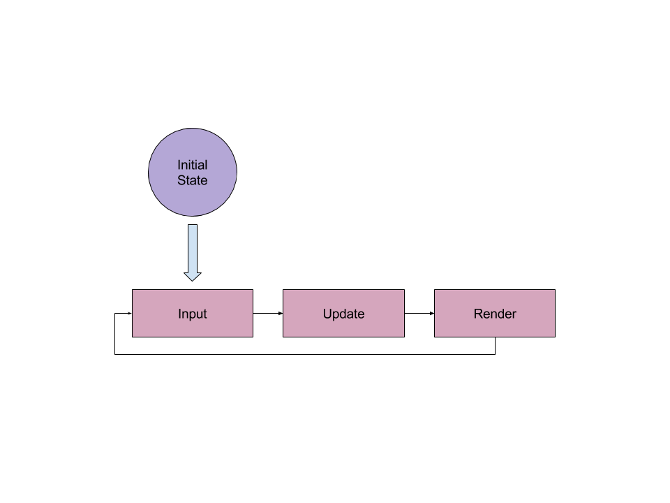
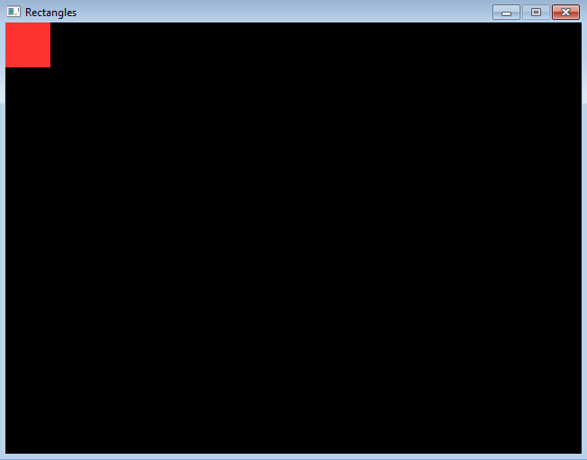

# Pygame

So by now we've got a good feel of how to construct a program in Python. Let's
get to the fun part, making games! Well hold your horses for a bit. Before we 
jump in let's get a high-level view of how games work.

## The Game Loop
The best way to think about games is by thinking about states. Huh? Well a state
is all the details of the world and objects inside it. Let's say you're doing an
exam (fun right?). The state at a given point in time would be all the questions
you answered, the amount of classmates writing the exam with you, how much ink
remaining in your pen, etc. 

All games have states as well. Take this classic - Super Mario Brothers!


http://www.retrogames.cz/games/005/NES_01.gif

When you first start the game your state will be Mario's position at the left
side of the screen, the positions of the other enemies, 0 points and 0 coins,
a full timer, the beginning of the soundtrack, the player's 3 lives, Mario's
small body and the fact that he's not moving. Thankfully, computers, unlike
humans, are really good at managing all these various pieces. 

Now when move the joystick to the right, Mario moves to the right as well. In 
Super Mario Brothers and in most good games, the feedback is instantenous, as 
you move your joystick the game updates. That's actually 2 steps in the game
loop. The first is the update step - given all the inputs and the time, update
the game state. So when you press the jump button, the update step will change
Mario's position to be in the air instead of on the floor. Finally, after the
update step we render, which as you expect displays the game on the screen. 
True to it's name this input -> update -> render process repeats until the user
quits the game.



### Game Loops And Python
If you think about it, everything you covered in Python can help make the game
loop. State? Think of storing data in variables, whether the data is a string, 
number, list, tuple or dictionary. Python has the `input` function to get user
input, we'll learn new functions to get user input. When we do collect user 
input, we'll decide what should happen in the game with if statements. All of
this will happen in a while loop that ends when the user decides to quit.

## Pygame
Despite the naming, Pygame isn't actually a game library or framework. It's best
described as a multimedia library, it focuses on being able to connect to all
the input and output devices like keyboards, joysticks and speakers. Don't be
discouraged, it's quite easy to build games from this. Let's not waste time with
this simple example:

In a new file `rectangles.py`, add the following lines to the top of the file:

```python
import pygame
import sys
```

So we import the Pygame library as well as the sys module, the latter is
included in Python installations. Now we add some variables we'll use later

```python
WIDTH, HEIGHT = (640, 480)
BLACK = (0, 0, 0)
WHITE = (255, 255, 255)
RED = (255, 50, 50)
GREEN = (50, 255, 50)
```

The keen reader would notice two things: all the variables are capitalised; and
in the first assignment WIDTH and HEIGHT are on the same line. The variables are
capitalised to show they're constants i.e. values that would not change. This is
a convention i.e. something the community maintains as good coding habits. You
can change the values of WIDTH, WHITE, RED or the others because they're 
variables. By capitalising, we're really telling other coders and ourselves that
these values don't change. 

As we saw with `WIDTH, HEIGHT = (640, 480)`, Python has the ability to declare
multiple variables in the same line. In this case, WIDTH is the first item of
the tuple on the right hand side, 640, and HEIGHT is therefore the second
item, 480. Recall that the values for width and height detail how many pixels
are being used.

```python
pygame.init() # You MUST call this method for pygame to work
screen = pygame.display.set_mode((WIDTH, HEIGHT)) # Set the screen size in Pygame
pygame.display.set_caption('Rectangles') # Text you'll see on the window bar
```

The above code initalises Pygame. As the comment stated, you have to call
`pygame.init()`. Your programs that use Pygame would not work without it!
Also, notice that WIDTH and HEIGHT are wrapped in brackets. The function
`pygame.display.set_mode` sets the screen size of the game. It take a sequence
with a number for width followed by height, so we use a tuple. Lastly, the
`set_caption` method puts the title of the window bar you'll see when running
Pygame. Now that the setup is done, let's do something!

```python
while True:
    for event in pygame.event.get():
        if event.type==pygame.QUIT:
            pygame.quit()
            sys.exit()

    screen.fill(BLACK) # Paint the screen black
    pygame.draw.rect(screen,RED,(0, 0,50,50)) # Draw a red rectangle
    pygame.display.update() # Render the changes to the screen
```

So the while loop is actually where our game loop begins with the while loop.
We only want the while loop to quit when the user quits, and there's an event
for that later on. So we put `while True:`, that way the loop will never exit.

In Pygame we use a for loop to get input from the player. We'll touch more on
that later but also ensure to include that for loop. Pygame needs that for loop
to function properly, specifically it needs a program to get the events. Even
if your code does not have much user interaction like what we're making, it 
still needs the for loop to get events.

```python
if event.type==pygame.QUIT:
    pygame.quit()
    sys.exit()
```

Let's say you're tired of your awesome game you'll be creating and decide to 
quit. Well we have to ensure you're closing off your game first, we do so with
the above if statement. After we verified that you want to exit, we first run
`pygame.quit()` to ensure it shuts off properly. Finally we exit the Python
program with good ole `sys.exit()`. 

```python
screen.fill(BLACK) # Paint the screen black
pygame.draw.rect(screen,RED,(0, 0, 50, 50)) # Draw a red rectangle
pygame.display.update() # Render the changes to the screen
```

The last bit of code is less tricky than the others. First we set the 
background of the screen to black by filling it with black pixels. We then
draw a red rectangle on the screen. Look at the arguments: the first is the
screen we're drawing on, the second is the colour but the last is quite
interesting. That argument is a tuple with four items describing where the
rectangle is going to be drawn and how big it'll be.

(0, 0, 50, 50)
1. x - 0
2. y - 0
3. width - 50
4. height - 50

Strange coordinates right? Well not too strange. In Pygame and many other
libraries used to create games, coordinates start at (0, 0) which means top-left.
So think of your game screen's window. If you had to write out coordinates
going from left to right, you'll start with (0, 0) and end with (WIDTH, 0). 
Essentially as you go right you keep adding one to the x-coordinate.

If you wanted to go downwards from the origin/top-left, you'll end up at
(0, HEIGHT). Essentially as you go down you keep adding one to the y-coordinate.
Here's a nifty diagram to help you out.

http://ctc-dev.verkstad.cc/en/course-literature/screens-and-pixels/

You'll get more hands on practice, just keep it in mind!

You should now have Python code that looks like the following:

```python
import pygame
import sys

WIDTH, HEIGHT = (640, 480)
BLACK = (0, 0, 0)
WHITE = (255, 255, 255)
RED = (255, 50, 50)
GREEN = (50, 255, 50)

pygame.init() # You MUST call this method for pygame to work
screen = pygame.display.set_mode((WIDTH, HEIGHT)) # Set the screen size in Pygame
pygame.display.set_caption('Rectangles') # Text you'll see on the window bar

while True:
    for event in pygame.event.get():
        if event.type==pygame.QUIT:
            pygame.quit()
            sys.exit()

    screen.fill(BLACK) # Paint the screen black
    pygame.draw.rect(screen,RED,(0, 0, 50, 50)) # Draw a red rectangle
    pygame.display.update() # Render the changes to the screen

```

Now let's run your file, rectangles.py. You should see the following:



Congratulations! You've just done your first Pygame script! We simply drew a
red rectangle on the screen that was 50 pixels long and wide (so really, it's
a square...).

### More Rectangles

You would have observed that we have more colours, let's draw
another rectangle - it'll be green, 30px wide and 20px long, and at the
bottom right corner of the screen.

The tricky part of this would be the position so let's think about it for a bit.
Every Pygame object on the screen has a corresponding rectangle with its
coordinates. As we mentioned before the coordinates are 4 numbers describing
how far away an object is from the origin on its: x coordinate, y coordinate,
width and height. The x and y coordinates are for the **top left** of the shape.

We know the screen's top left is (0, 0), the top right is (WIDTH, 0), the
bottom left is (0, HEIGHT). So what's the bottom right corner? That's right:
(WIDTH, HEIGHT). Confused? If you went all the way to the right you travelled 
the entire width of the game screen. If you went all the way to the bottom
you travelled the entire height of the game screen. Put them together and you
got bottom right.

1. x - we need this to be 30px away from the right. So, WIDTH - 30
2. y - we need this to be 20px away from the bottom. So. HEIGHT - 20
3. width - 30px
4. height - 20px

With the desired rectangle coordinates, we can finally draw it

```python
pygame.draw.rect(screen,GREEN,(WIDTH - 30, HEIGHT - 20, 30, 20))
```

It's beautiful! We got an elegant, tiny rectangle in the corner. I think it 
would look better if we had some space from the corner, don't you think?
Let's try this instead:

```python
pygame.draw.rect(screen,GREEN,(WIDTH - 40, HEIGHT - 30, 30, 20))
```

Nice! That should be all right for the green rectangle for now. 

## Exercises
1. Read the following documentation for drawing circles:
    https://www.pygame.org/docs/ref/draw.html#pygame.draw.circle
    Draw a red circle in place of the red rectangle
2. Read the following documentation for drawing ellipses:
    https://www.pygame.org/docs/ref/draw.html#pygame.draw.ellipse
    Draw a green ellipse in place of the green rectangle

## Animation